- [ロボコン](#ロボコン)
  - [ABU Robocon 2022 技術賞 (豊橋技術科学大学)](#abu-robocon-2022-技術賞-豊橋技術科学大学)
    - [担当](#担当)
      - [R1ロボット (画像左) の全制御](#r1ロボット-画像左-の全制御)
      - [その他](#その他)
  - [学生ロボコン 2022 優勝 (豊橋技術科学大学)](#学生ロボコン-2022-優勝-豊橋技術科学大学)
    - [担当](#担当-1)
      - [R1ロボット (画像左) の全制御](#r1ロボット-画像左-の全制御-1)
      - [その他](#その他-1)
  - [東海地区交流ロボコン 2021 優勝 (豊橋技術科学大学 シン・夜に駆ける)](#東海地区交流ロボコン-2021-優勝-豊橋技術科学大学-シン夜に駆ける)
    - [担当](#担当-2)
      - [ロボットの全制御](#ロボットの全制御)
  - [RoboMaster 2019 Japan Winter Camp 準優勝 (Scramble)](#robomaster-2019-japan-winter-camp-準優勝-scramble)
    - [担当](#担当-3)
      - [3台のロボットの制御](#3台のロボットの制御)
  - [RoboMaster 2019 Japan Summer Camp 優勝 (Scramble)](#robomaster-2019-japan-summer-camp-優勝-scramble)
    - [担当](#担当-4)
      - [2台のロボットの全制御](#2台のロボットの全制御)
  - [高専ロボコン 2018 近畿地区大会 技術賞 (舞鶴高専Bチーム)](#高専ロボコン-2018-近畿地区大会-技術賞-舞鶴高専bチーム)
    - [担当](#担当-5)
      - [2台のロボットの全制御](#2台のロボットの全制御-1)
      - [その他](#その他-2)
  - [近畿地区合同ロボコン 2018 合ロボ大賞 (舞鶴高専Bチーム)](#近畿地区合同ロボコン-2018-合ロボ大賞-舞鶴高専bチーム)
    - [担当](#担当-6)
      - [ロボットの全制御](#ロボットの全制御-1)
- [個人開発](#個人開発)
  - [点群マッチング](#点群マッチング)
  - [メタヒューリスティクスアルゴリズム](#メタヒューリスティクスアルゴリズム)

# ロボコン
## ABU Robocon 2022 技術賞 (豊橋技術科学大学)
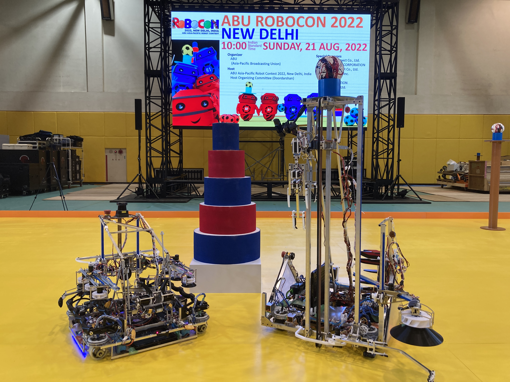

[ライブ配信](https://youtu.be/GEz8ktGMHKE)  
&emsp;[vs 香港](https://youtu.be/GEz8ktGMHKE?t=9644)  
&emsp;[vs 中国](https://youtu.be/GEz8ktGMHKE?t=15276)  

### 担当
#### R1ロボット (画像左) の全制御
* 動作の自動化
* 足回り制御（独立4輪ステアリング）
* 経路生成（加速度制約時の時間最適経路）
* 経路追従
* 自己位置推定（LiDAR + オドメトリ）
* ボール射出制御
* 全機構の制御

#### その他
* チーム副リーダー
* 制御班リーダー
* 2台のロボットの操縦者

## 学生ロボコン 2022 優勝 (豊橋技術科学大学)
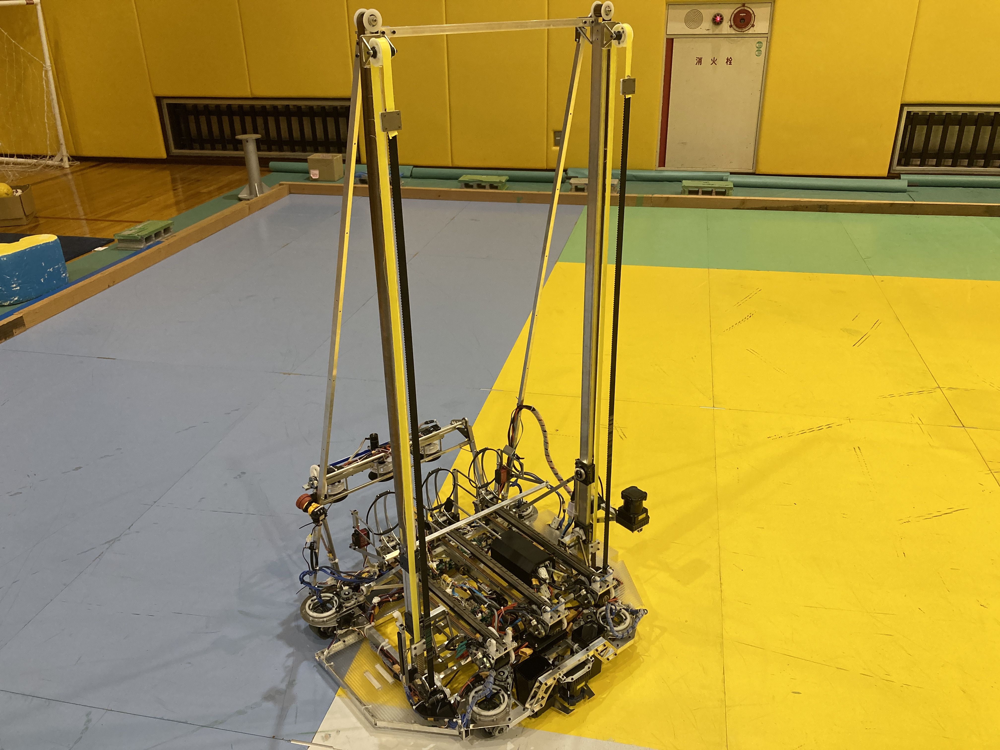 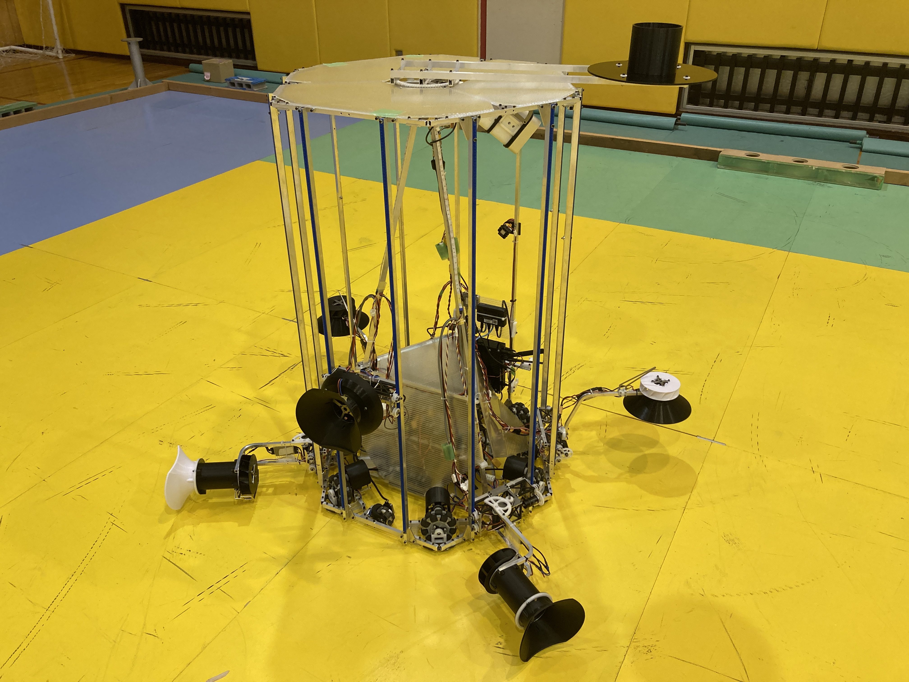
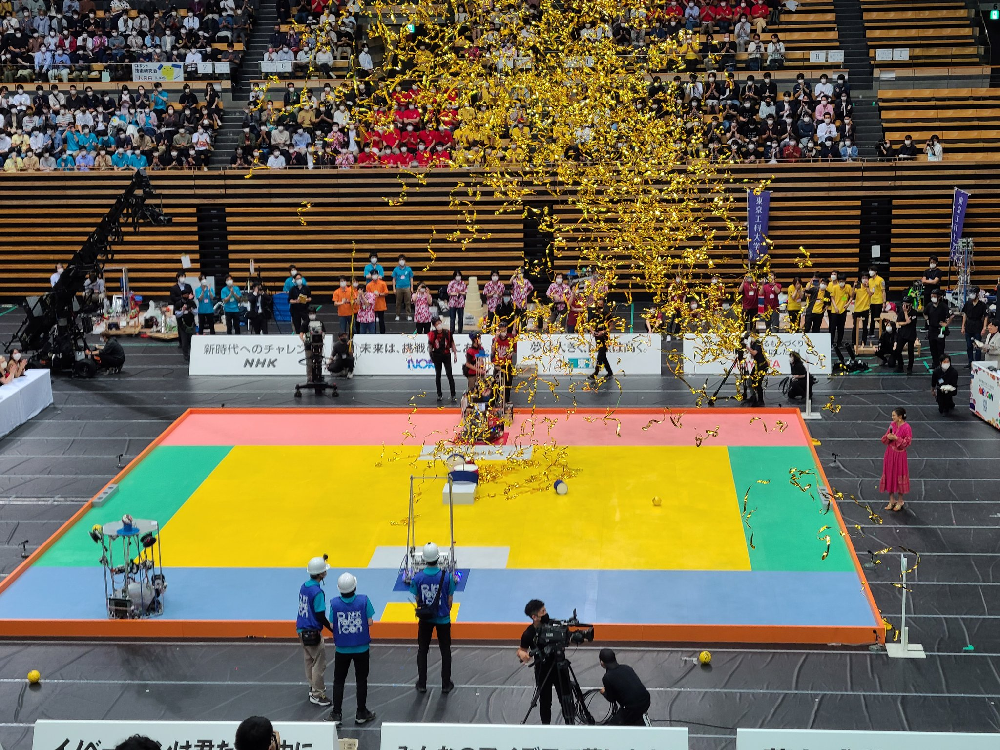

[ライブ配信](https://youtu.be/juYlfcXIgFk)  
&emsp;[vs 新潟大学](https://youtu.be/juYlfcXIgFk?t=12778)  
&emsp;[vs 東京工科大学](https://youtu.be/juYlfcXIgFk?t=14175)  
&emsp;[vs 金沢工業大学](https://youtu.be/juYlfcXIgFk?t=15974)  

### 担当
#### R1ロボット (画像左) の全制御
* 足回り制御（独立4輪ステアリング）
* 動作の自動化
* 経路生成（加速度制約時の時間最適経路）
* 経路追従
* 自己位置推定（LiDAR + オドメトリ）
* ボール射出制御
* 照準制御
* 全機構の制御

#### その他
* チーム副リーダー
* 制御班リーダー
* 2台のロボットの操縦者

## 東海地区交流ロボコン 2021 優勝 (豊橋技術科学大学 シン・夜に駆ける)

[公式動画](https://youtu.be/r3PSpSyNytc)  

### 担当
#### ロボットの全制御
* 足回り制御（独立4輪ステアリング）
* 動作の自動化
* 経路生成（加速度制約時の時間最適経路）
* 経路追従
* 自己位置推定（オドメトリ）

## RoboMaster 2019 Japan Winter Camp 準優勝 (Scramble)
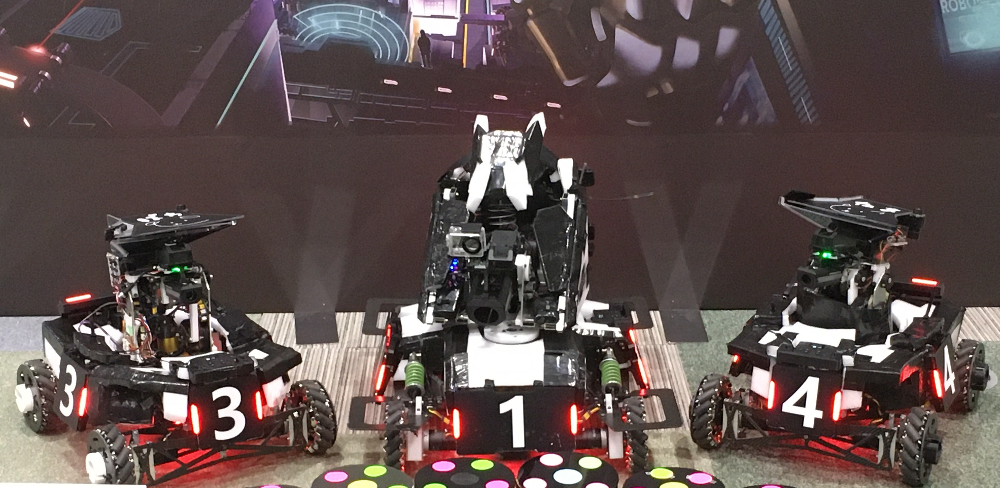

[ライブ配信](https://youtu.be/P0eWW-5VMdE)  
&emsp;[vs OOEDO SAMRAI](https://youtu.be/P0eWW-5VMdE?t=18268)  

### 担当
#### 3台のロボットの制御
* 足回り制御（4輪メカナムホイール）
* 砲塔制御
* 射出制御
* その他機構制御
* 操縦画面制御

## RoboMaster 2019 Japan Summer Camp 優勝 (Scramble)
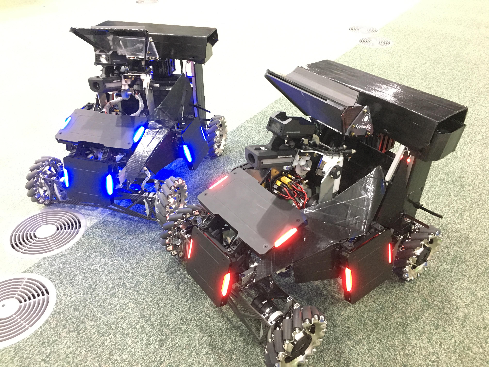

[ライブ配信](https://youtu.be/BjuciTLCysc)  
&emsp;[vs OSAKA TAKOYAKI](https://youtu.be/BjuciTLCysc?t=21765)  
&emsp;[vs FUKUOKA NIWAKA杠](https://youtu.be/BjuciTLCysc?t=31958)  

### 担当
#### 2台のロボットの全制御
* 足回り制御（4輪メカナムホイール）
* 砲塔制御
* 射出制御
* その他機構制御

## 高専ロボコン 2018 近畿地区大会 技術賞 (舞鶴高専Bチーム)
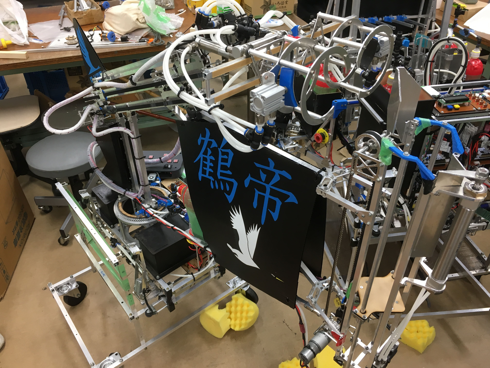 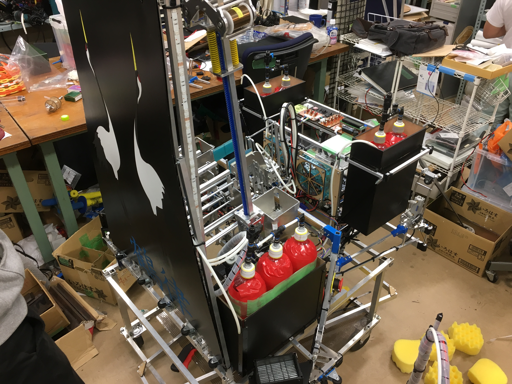

[ライブ配信](https://youtu.be/VNDaD8h3bwo)  
&emsp;[vs 神戸高専Aチーム](https://youtu.be/VNDaD8h3bwo?t=8318)  

### 担当
#### 2台のロボットの全制御
* 動作の自動化
* 足回り制御（3輪オムニホイール）
* 自己位置推定（オドメトリ）
* 全機構制御
* フィールドオブジェクト検出
* コントローラ作成

#### その他
* チームリーダー

## 近畿地区合同ロボコン 2018 合ロボ大賞 (舞鶴高専Bチーム)
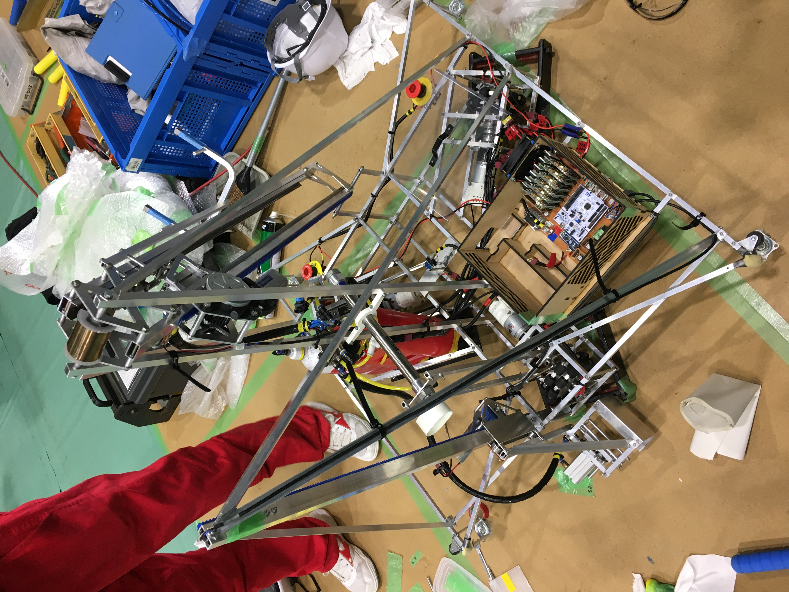

[ライブ配信](https://youtu.be/EfnJvspgEZU)  
&emsp;[vs 香川高専高松キャンパス](https://youtu.be/EfnJvspgEZU?t=2416)  
&emsp;[エキシビジョン](https://youtu.be/EfnJvspgEZU?t=7826)  

### 担当
#### ロボットの全制御
* 動作の半自動化
* 足回り制御（3輪オムニホイール）
* 全機構制御
* コントローラ作成

# 個人開発
## 点群マッチング
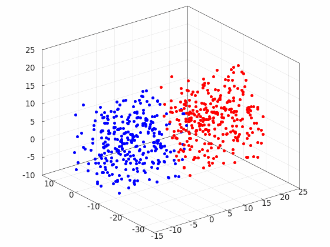 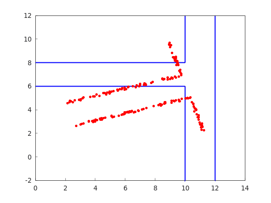
[リポジトリ](https://github.com/TakumaNakao/mathematical_robotics)

## メタヒューリスティクスアルゴリズム
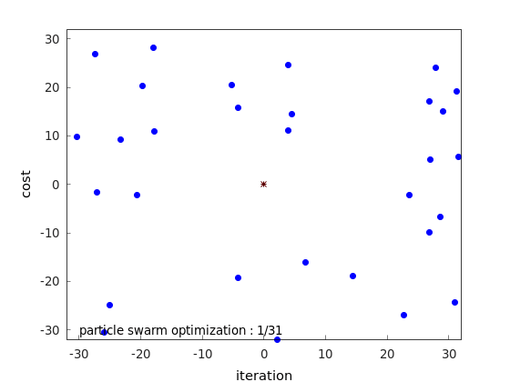 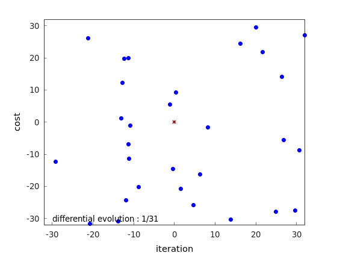
[リポジトリ](https://github.com/TakumaNakao/metaheuristics_optimization)